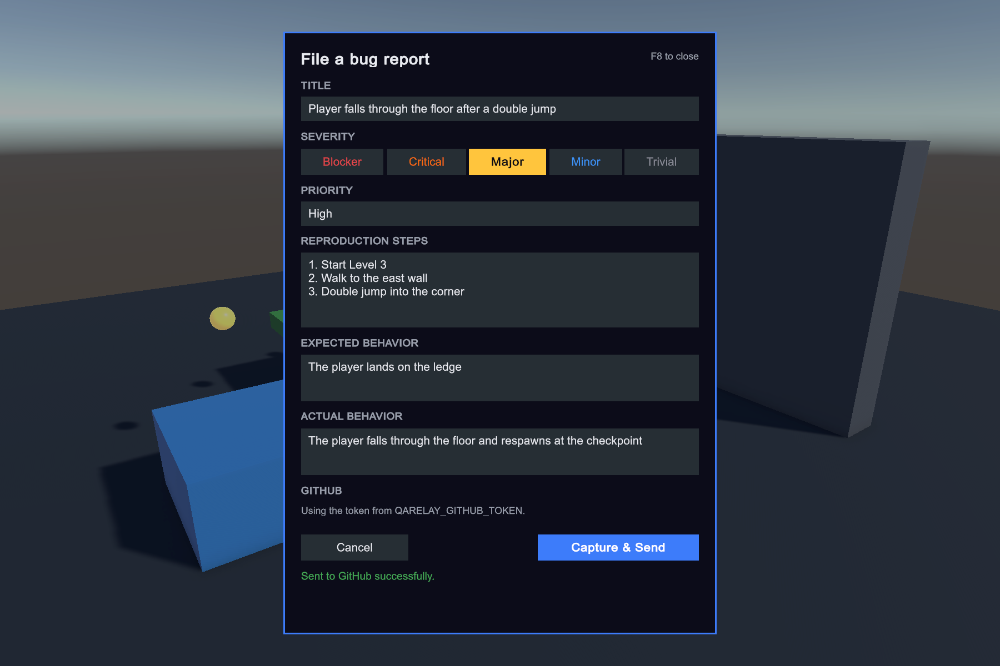
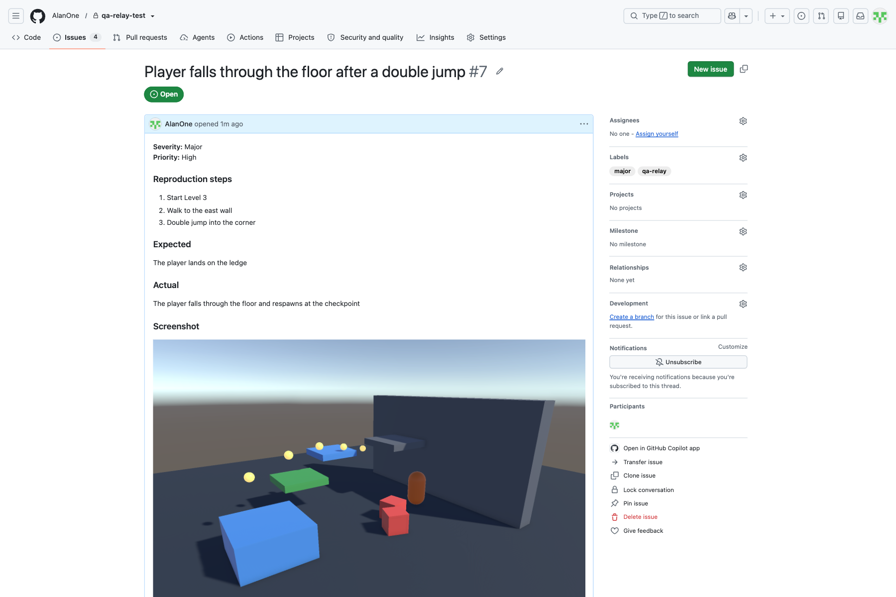

Every in-game feedback tool I looked at for Unity does roughly the same
thing: a screenshot and a text box, posted to Discord or a chat channel.
That's fine for a solo dev collecting playtester impressions. It's not how
a QA team works. QA wants a report with a severity, a priority, numbered
reproduction steps, expected versus actual behavior, and the context a
tester always forgets to write down: build, scene, device, resolution,
what the console said. And it wants that report in the tracker the team
already uses, not in a chat scrollback.

So I built [QA Relay](https://assetstore.unity.com/packages/package/759269):
press F8 anywhere in the game, in the Editor or in a build, fill in the
form, and it files a GitHub issue.

## What it does

- **The screenshot is taken the moment you press F8**, one frame before the
  form opens, so it shows the game, not the form on top of it.
- **Structured fields**: title, severity (Blocker to Trivial, filed as an
  issue label), priority, reproduction steps, expected and actual behavior.
- **Context captured automatically**: the last console lines, build version,
  active scene, platform, device model, GPU, and the game's render
  resolution next to the display's.
- **Every report is saved on the tester's machine first**, as JSON plus the
  PNG, before any network call. An offline QA lab or a failed export never
  loses a report.
- **Works with the Input System, the legacy Input Manager, or both**, and
  with any render pipeline. The form is IMGUI, so it needs no scene or
  prefab setup: one component and one settings asset.

And on the GitHub side, the issue comes out like this, labelled, with the
screenshot inline:

## Attaching a screenshot without an API for it

GitHub's Issues API has no endpoint for attaching an image. Dragging a
screenshot into an issue in the browser uses an internal upload that isn't
documented for API clients. The usual workaround is committing the image to
the repository and linking to it, which means your QA screenshots end up in
your git history.

It turns out GitHub's own command-line tool can attach images now:
`gh issue create --attach ./shot.png`. Running it with `GH_DEBUG=api` shows
exactly what it does: one `POST` of the raw PNG bytes to
`uploads.github.com/user-attachments/assets`, with the file name, content
type and the repository's numeric ID as query parameters, and a JSON reply
with the attachment URL. That URL goes into the issue body as a normal
Markdown image. Nothing is added to the repository, and it works with a
fine-grained token that only has *Issues: write*.

The catch is that the endpoint is undocumented, so GitHub could change it.
QA Relay treats the attachment as best-effort: if the upload fails, the
issue is still created with the screenshot's local path instead, and the
form tells the tester why. If it ever breaks, the same `GH_DEBUG=api`
trace shows what changed.

## Keeping the token out of your builds

The obvious place for a GitHub token is the settings asset, next to the
repo name. That's also the wrong place: a ScriptableObject referenced by a
scene ships inside every build, so anyone with a QA build could pull the
token out of it. (The Asset Store rejects packages that store API keys that
way, for the same reason.)

QA Relay reads the token from a `QARELAY_GITHUB_TOKEN` environment
variable if there is one, which is handy for CI and managed QA machines.
Otherwise each tester pastes their own token into the form once, and it's
saved with `PlayerPrefs` on their machine only. A side effect I like:
issues are filed under the name of the tester who reported them.

## Four Unity pitfalls the first real run found

I wrote the first version without a Unity Editor on the machine, so its
first run in a real project was also its first real test. It found four
bugs worth knowing about even if you never use this tool.

**1. `Input.GetKeyDown` throws in every new Unity 6 project.** New projects
from the current templates set *Active Input Handling* to the Input System
package only. In that mode, any call to the legacy `UnityEngine.Input`
class throws an `InvalidOperationException`, every frame. The hotkey
could never work. The fix reads the key through whichever backend is
active: an asmdef `versionDefines` entry sets a define when the Input
System package is installed, `ENABLE_INPUT_SYSTEM` and
`ENABLE_LEGACY_INPUT_MANAGER` say which backend is on, and the settings keep
a `KeyCode` that gets mapped to the Input System's `Key` (their names
differ for digits, numpad keys, Return and a few others). My first version
of that fix didn't compile in a project that has the Input System package
installed but uses legacy input, which is why every input change now gets
tested in all three setups.

**2. Recompiling during Play Mode left the component half-alive.** By
default Unity recompiles and keeps playing when you save a script. It
reloads each MonoBehaviour keeping only its serialized fields, then calls
`OnEnable` again, but never `Awake`. Everything QA Relay created in `Awake`
came back null, and `Update` threw a `NullReferenceException` every frame:
999+ errors in the console the first time I edited the package while the
game was running. Setup moved to `OnEnable`/`OnDisable`.

**3. In Linear color space, the form was washed out.** URP, HDRP and every
current template use Linear color space. In that mode IMGUI treats the
pixels of textures you create with `Texture2D.SetPixel` as linear values
and encodes them to sRGB on output. The form's dark `#1B1D23` panel came
out as `#5C5F68` in a real build, which is exactly what that double encode
predicts, and the severity colors went pale. Text colors weren't affected
(converting those too made them visibly too dark), so only the background
textures now go through `Color.linear` first.

**4. Two reports in the same second overwrote each other.** File names
were timestamped to the second. For a tool whose whole point is never
losing a report, that one hurt. Milliseconds plus a counter now.

One testing gotcha on top: `WaitForEndOfFrame` never resumes in batch
mode, because nothing renders a frame. A headless test that waited for the
screenshot just sat there at full CPU until I killed it. The Play Mode
tests skip the screenshot when `Application.isBatchMode` is set, and every
test has a timeout now.

## Getting it

QA Relay is on the Unity Asset Store for $19.99, installed through the
Package Manager like any UPM package, with the full C# source, a demo
scene and its Play Mode tests.

- Unity 2022.3 or newer; any render pipeline; either input backend.
- A GitHub account, a repository for the reports, and a fine-grained
  token with *Issues: write* on it for each tester. The GitHub API is free;
  each report uses three requests.
- Tested in Unity 2022.3 and 6.5, in the Editor on macOS and in a macOS
  build.

It currently supports GitHub Issues only. Jira, Azure DevOps and Linear
would be the natural next exporters.

*Disclosure: the code, tests and documentation were written with the help
of an AI coding assistant (Claude), with the design decisions, review and
testing by hand done by me.*
